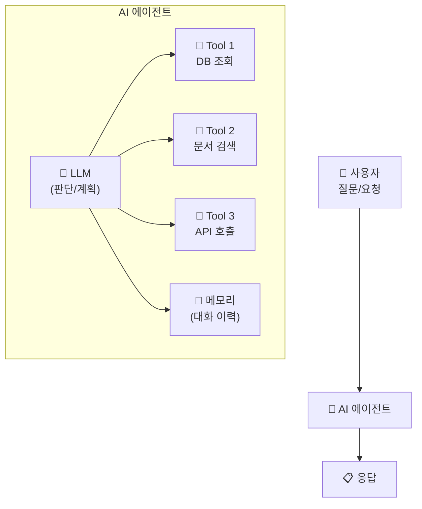
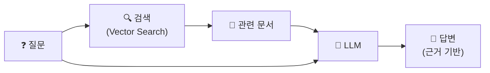

# AI 에이전트란?

## 개념

> 💡 **AI 에이전트(AI Agent)**란 LLM(대규모 언어 모델)을 두뇌로 사용하여, **스스로 판단하고 도구를 호출하며 작업을 수행**하는 자율적인 AI 시스템입니다. 단순한 챗봇과 달리, 에이전트는 목표를 달성하기 위해 여러 단계를 계획하고 실행합니다.

---

## 에이전트의 구성 요소

| 구성 요소 | 역할 |
|-----------|------|
| **LLM (두뇌)** | 사용자 요청을 이해하고, 어떤 도구를 사용할지 판단합니다 |
| **Tools (도구)** | 에이전트가 실행할 수 있는 구체적인 액션입니다 (SQL 실행, 검색 등) |
| **Retriever (검색기)** | 관련 문서/데이터를 검색하여 LLM에 맥락을 제공합니다 |
| **Memory (메모리)** | 대화 이력을 저장하여 맥락을 유지합니다 |

---

## RAG (Retrieval-Augmented Generation)

> 💡 **RAG(검색 증강 생성)**은 LLM이 답변할 때, 먼저 관련 문서를 **검색(Retrieve)**하여 맥락으로 제공한 후, 그 맥락을 바탕으로 답변을 **생성(Generate)**하는 패턴입니다. LLM이 학습하지 않은 최신 정보나 기업 내부 문서에 대해서도 정확한 답변을 할 수 있게 해 줍니다.

---

## 참고 링크

- [Databricks: Generative AI](https://docs.databricks.com/aws/en/generative-ai/)
