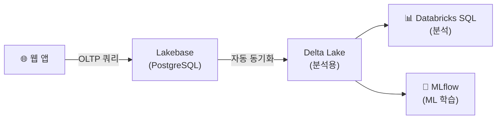

# Data Sync — Lakebase ↔ Delta Lake

## 자동 동기화

> 💡 **Data Sync**는 Lakebase의 데이터를 **자동으로 Delta Lake 테이블에 동기화**하는 기능입니다. Lakebase에서 INSERT/UPDATE/DELETE된 데이터가 Delta 테이블에 실시간으로 반영됩니다.

---

## 장점

| 장점 | 설명 |
|------|------|
| **ETL 불필요** | 별도의 ETL 파이프라인을 구축할 필요가 없습니다 |
| **실시간 반영** | OLTP 변경이 거의 실시간으로 분석 테이블에 반영됩니다 |
| **통합 거버넌스** | Unity Catalog에서 OLTP와 OLAP 데이터를 함께 관리합니다 |

---

## 참고 링크

- [Databricks: Lakebase data sync](https://docs.databricks.com/aws/en/lakebase/)
