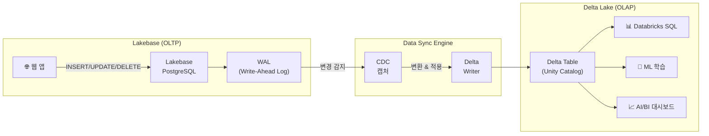
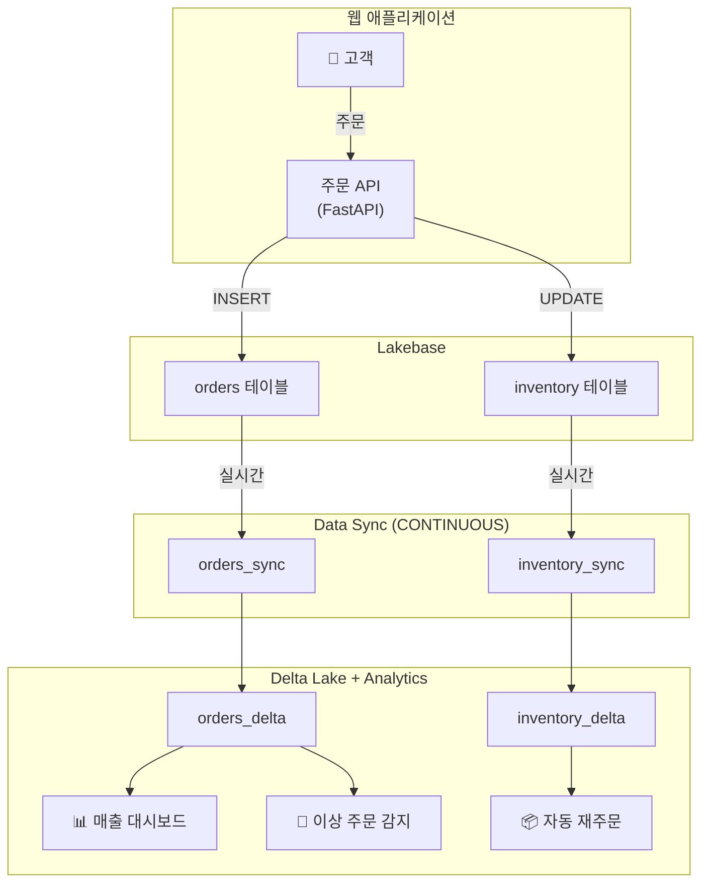

# Data Sync — Lakebase ↔ Delta Lake

## 왜 Data Sync가 필요한가요?

기업 환경에서 **OLTP 데이터**(주문, 결제, 재고 등)를 분석에 활용하려면, 전통적으로 **ETL 파이프라인**을 별도로 구축해야 했습니다. 이 과정에서 다음과 같은 문제가 반복적으로 발생합니다.

| 기존 문제 | 영향 |
|-----------|------|
| ETL 파이프라인 구축·운영 비용 | 데이터 엔지니어가 CDC 파이프라인을 직접 개발하고 유지보수해야 합니다 |
| 데이터 지연 (시간~일 단위) | 실시간 대시보드, 실시간 ML 피처 갱신이 불가능합니다 |
| 스키마 불일치 | OLTP 스키마가 변경되면 ETL이 깨지고, 수동 수정이 필요합니다 |
| 거버넌스 분리 | OLTP와 OLAP의 접근 권한을 별도로 관리해야 합니다 |

> 💡 **Data Sync**는 Lakebase의 데이터를 **자동으로 Delta Lake 테이블에 동기화**하는 기능입니다. 별도의 ETL 파이프라인 없이, Lakebase에서 INSERT/UPDATE/DELETE된 데이터가 Delta Lake 테이블에 자동 반영됩니다.

> 💡 **CDC (Change Data Capture)**: 데이터베이스에서 발생하는 변경사항(삽입, 수정, 삭제)을 감지하여 다른 시스템에 전달하는 기술입니다. Data Sync는 내부적으로 CDC를 활용하여 변경분만 효율적으로 동기화합니다.

---

## 동기화 아키텍처



Data Sync는 PostgreSQL의 **WAL(Write-Ahead Log)** 을 기반으로 변경사항을 캡처합니다. 전체 데이터를 복사하는 것이 아니라, **변경분(Delta)만 증분 처리**하므로 네트워크 비용과 처리 시간이 최소화됩니다.

---

## 동기화 방향

### Forward Sync (Lakebase → Delta Lake)

가장 일반적인 패턴으로, Lakebase의 OLTP 데이터를 Delta Lake로 동기화합니다. 웹 앱에서 생성된 운영 데이터를 분석 환경에서 바로 활용할 수 있습니다.

| 사용 사례 | 설명 |
|-----------|------|
| 실시간 대시보드 | 주문 현황, 매출 집계가 거의 실시간으로 대시보드에 반영됩니다 |
| ML 피처 갱신 | 사용자 행동 데이터가 ML 피처 테이블에 자동 반영됩니다 |
| 리포팅 | OLTP 데이터를 분석 쿼리에 안전하게 사용합니다 (OLTP 부하 없음) |

### Reverse Sync (Delta Lake → Lakebase)

분석 결과나 ML 추론 결과를 다시 Lakebase로 동기화하여, 웹 앱에서 즉시 활용할 수 있습니다.

| 사용 사례 | 설명 |
|-----------|------|
| ML 추천 결과 서빙 | 배치 추론 결과를 Lakebase에 저장하여 앱에서 실시간 조회합니다 |
| 집계 데이터 서빙 | Delta Lake에서 계산한 집계 결과를 앱의 요약 화면에 제공합니다 |
| 데이터 보강 | 분석 파이프라인에서 보강된 데이터를 운영 DB에 반영합니다 |

---

## 동기화 정책 (Sync Mode)

Data Sync는 세 가지 동기화 모드를 제공합니다. 비즈니스 요구사항에 따라 적절한 모드를 선택하시면 됩니다.

| 모드 | 동작 방식 | 지연시간 | 비용 | 적합한 상황 |
|------|-----------|----------|------|-------------|
| **CONTINUOUS** | 변경 발생 시 즉시 동기화 | 초~분 단위 | 높음 | 실시간 대시보드, 실시간 ML 피처 |
| **TRIGGERED** | 수동 또는 스케줄로 동기화 실행 | 분~시간 단위 | 중간 | 정기 리포팅, 비용 최적화 |
| **SNAPSHOT** | 전체 데이터를 통째로 복사 | 분~시간 단위 | 가변적 | 초기 로드, 대규모 스키마 변경 후 재동기화 |

> ⚠️ **CONTINUOUS 모드**는 변경사항을 지속적으로 모니터링하므로 컴퓨팅 비용이 발생합니다. 실시간성이 반드시 필요한 테이블에만 사용하는 것을 권장합니다.

---

## 실습: 동기화 설정하기

### 1단계: Lakebase 데이터베이스와 테이블 준비

```sql
-- Lakebase 데이터베이스 생성 (이미 생성되어 있다면 건너뜁니다)
CREATE DATABASE my_catalog.my_schema.ecommerce_db
TYPE LAKEBASE;

-- Lakebase에 테이블 생성
-- psql 또는 Python 클라이언트로 접속하여 실행합니다
CREATE TABLE orders (
    order_id    SERIAL PRIMARY KEY,
    customer_id INTEGER NOT NULL,
    product     VARCHAR(200) NOT NULL,
    amount      DECIMAL(10,2) NOT NULL,
    status      VARCHAR(20) DEFAULT 'pending',
    created_at  TIMESTAMP DEFAULT CURRENT_TIMESTAMP,
    updated_at  TIMESTAMP DEFAULT CURRENT_TIMESTAMP
);

CREATE TABLE customers (
    customer_id SERIAL PRIMARY KEY,
    name        VARCHAR(100) NOT NULL,
    email       VARCHAR(200) UNIQUE NOT NULL,
    tier        VARCHAR(20) DEFAULT 'standard',
    created_at  TIMESTAMP DEFAULT CURRENT_TIMESTAMP
);
```

### 2단계: Forward Sync 설정 (SQL)

```sql
-- orders 테이블의 CONTINUOUS 동기화 설정
CREATE SYNC my_catalog.my_schema.orders_sync
SOURCE my_catalog.my_schema.ecommerce_db.orders
TARGET my_catalog.my_schema.orders_delta
MODE CONTINUOUS;

-- customers 테이블의 TRIGGERED 동기화 설정 (비용 절감)
CREATE SYNC my_catalog.my_schema.customers_sync
SOURCE my_catalog.my_schema.ecommerce_db.customers
TARGET my_catalog.my_schema.customers_delta
MODE TRIGGERED;
```

### 3단계: Python SDK를 사용한 동기화 설정

```python
from databricks.sdk import WorkspaceClient

w = WorkspaceClient()

# CONTINUOUS 동기화 생성
sync = w.lakebase.create_sync(
    name="orders_sync",
    source_database="my_catalog.my_schema.ecommerce_db",
    source_table="orders",
    target_catalog="my_catalog",
    target_schema="my_schema",
    target_table="orders_delta",
    mode="CONTINUOUS"
)

print(f"동기화 생성 완료: {sync.name}")
print(f"상태: {sync.state}")
```

### 4단계: TRIGGERED 모드 수동 실행

```sql
-- TRIGGERED 모드의 동기화를 수동으로 실행합니다
ALTER SYNC my_catalog.my_schema.customers_sync TRIGGER;
```

```python
# Python SDK로 트리거 실행
w.lakebase.trigger_sync(name="customers_sync")
```

---

## 스키마 변경 처리

Lakebase 테이블의 스키마가 변경되면, Data Sync가 자동으로 대응합니다. 다만 변경 유형에 따라 동작이 달라집니다.

| 스키마 변경 | Data Sync 동작 | 추가 조치 필요 여부 |
|-------------|---------------|---------------------|
| **컬럼 추가** (ADD COLUMN) | Delta 테이블에 자동으로 컬럼이 추가됩니다 | 불필요 |
| **컬럼 삭제** (DROP COLUMN) | Delta 테이블에서 해당 컬럼이 NULL로 채워집니다 | 필요 시 수동 정리 |
| **데이터 타입 변경** | 호환 가능한 변환은 자동 처리, 비호환은 동기화 중단 | 비호환 시 재설정 필요 |
| **테이블 삭제/재생성** | 동기화가 중단됩니다 | 동기화 재설정 필요 |

> ⚠️ **비호환 스키마 변경**(예: VARCHAR → INTEGER)은 동기화를 중단시킬 수 있습니다. 대규모 스키마 변경 전에는 동기화를 일시 중지하고, 변경 후 SNAPSHOT 모드로 재동기화하는 것을 권장합니다.

```sql
-- 스키마 변경 전: 동기화 일시 중지
ALTER SYNC my_catalog.my_schema.orders_sync PAUSE;

-- Lakebase에서 스키마 변경 수행
-- (psql 등으로 접속하여 ALTER TABLE 실행)

-- 스키마 변경 후: 동기화 재개
ALTER SYNC my_catalog.my_schema.orders_sync RESUME;
```

---

## 동기화 모니터링

### 상태 확인

```sql
-- 동기화 상태 조회
DESCRIBE SYNC my_catalog.my_schema.orders_sync;

-- 결과 예시:
-- name: orders_sync
-- state: RUNNING
-- mode: CONTINUOUS
-- source: my_catalog.my_schema.ecommerce_db.orders
-- target: my_catalog.my_schema.orders_delta
-- last_sync_time: 2025-06-15T10:30:45Z
-- rows_synced: 1,234,567
-- lag_seconds: 3
```

```python
# Python SDK로 상태 확인
sync_status = w.lakebase.get_sync(name="orders_sync")

print(f"상태: {sync_status.state}")
print(f"마지막 동기화: {sync_status.last_sync_time}")
print(f"동기화된 행 수: {sync_status.rows_synced}")
print(f"지연시간(초): {sync_status.lag_seconds}")
```

### 주요 메트릭

| 메트릭 | 설명 | 정상 범위 |
|--------|------|-----------|
| **lag_seconds** | 현재 동기화 지연 시간 | CONTINUOUS: < 60초 |
| **rows_synced** | 누적 동기화된 행 수 | 지속 증가 |
| **errors_count** | 동기화 오류 횟수 | 0 |
| **state** | 동기화 상태 | RUNNING |
| **throughput_rows_per_sec** | 초당 처리 행 수 | 워크로드에 따라 다름 |

> 💡 **모니터링 팁**: `lag_seconds`가 지속적으로 증가하면 소스 테이블의 쓰기 속도가 동기화 처리 속도를 초과하는 것입니다. 이 경우 인스턴스 사이즈를 조정하거나, 동기화 대상 테이블을 분리하는 것을 검토하시기 바랍니다.

---

## 실패 복구 및 트러블슈팅

### 일반적인 문제와 해결 방법

| 증상 | 원인 | 해결 방법 |
|------|------|-----------|
| 동기화 상태가 `FAILED` | 스키마 비호환, 권한 문제, 네트워크 오류 | 오류 메시지 확인 후 원인 해결, `RESUME`으로 재개 |
| `lag_seconds` 지속 증가 | 쓰기 볼륨이 동기화 처리량 초과 | 인스턴스 크기 조정 또는 TRIGGERED 모드로 전환 |
| Delta 테이블에 데이터 누락 | 일시적 네트워크 오류 | Data Sync는 exactly-once를 보장하므로 자동 복구됨. 지속 시 SNAPSHOT 재동기화 |
| 권한 오류 | Unity Catalog 권한 부족 | 대상 카탈로그/스키마에 대한 쓰기 권한 부여 |

### 동기화 재설정 (전체 재동기화)

문제가 지속되거나 대규모 스키마 변경 후에는 동기화를 삭제하고 재생성합니다.

```sql
-- 기존 동기화 삭제
DROP SYNC my_catalog.my_schema.orders_sync;

-- SNAPSHOT 모드로 전체 재동기화 (초기 로드)
CREATE SYNC my_catalog.my_schema.orders_sync
SOURCE my_catalog.my_schema.ecommerce_db.orders
TARGET my_catalog.my_schema.orders_delta
MODE SNAPSHOT;

-- 초기 로드 완료 후 CONTINUOUS로 변경
ALTER SYNC my_catalog.my_schema.orders_sync
SET MODE CONTINUOUS;
```

---

## 성능 고려사항

### 대용량 테이블 동기화

| 테이블 크기 | 권장 접근법 |
|-------------|-------------|
| 1GB 미만 | CONTINUOUS 모드로 바로 시작합니다 |
| 1GB ~ 100GB | SNAPSHOT으로 초기 로드 후 CONTINUOUS로 전환합니다 |
| 100GB 이상 | 테이블을 파티션 단위로 나누어 단계적으로 동기화합니다 |

### 지연시간 최적화 팁

1. **인덱스 설계**: Lakebase 테이블에 적절한 인덱스가 있으면 변경 캡처가 빨라집니다
2. **배치 크기 조정**: 대량 INSERT 시 적절한 배치 크기(1,000~10,000행)를 사용합니다
3. **핫 테이블 분리**: 변경이 매우 빈번한 테이블은 별도의 동기화 설정을 합니다
4. **불필요한 컬럼 제외**: 분석에 필요 없는 대용량 컬럼(BLOB 등)은 동기화에서 제외합니다

> 💡 **Exactly-once 보장**: Data Sync는 **exactly-once 시맨틱**을 보장합니다. 네트워크 오류나 일시적 장애가 발생하더라도 데이터가 중복되거나 누락되지 않습니다.

---

## 제한사항 및 주의사항

| 제한사항 | 설명 |
|----------|------|
| **지원 데이터 타입** | PostgreSQL의 대부분의 기본 타입을 지원하지만, 사용자 정의 타입(ENUM, Composite)은 제한될 수 있습니다 |
| **DDL 자동 반영** | 일부 DDL(ALTER TABLE)은 자동 반영되지만, 테이블 삭제/재생성은 동기화를 중단합니다 |
| **동기화 방향** | 하나의 Sync 설정은 한 방향만 지원합니다. 양방향이 필요하면 두 개의 Sync를 설정합니다 |
| **동시 동기화 수** | 인스턴스당 동시 실행 가능한 동기화 수에 제한이 있습니다 |
| **대용량 트랜잭션** | 단일 트랜잭션에서 수백만 행을 변경하면 동기화 지연이 발생할 수 있습니다 |

> ⚠️ **양방향 동기화 주의**: Forward Sync와 Reverse Sync를 동시에 설정하면 **데이터 충돌**이 발생할 수 있습니다. 양방향이 필요한 경우, 쓰기 권한을 한쪽에만 부여하여 충돌을 방지하시기 바랍니다.

---

## 실전 시나리오: 이커머스 주문 분석 파이프라인

다음은 이커머스 앱의 주문 데이터를 실시간으로 분석하는 전체 흐름입니다.



```sql
-- Delta Lake에서 실시간 매출 분석 쿼리 (DBSQL에서 실행)
SELECT
    DATE_TRUNC('hour', created_at) AS order_hour,
    COUNT(*) AS order_count,
    SUM(amount) AS total_revenue,
    AVG(amount) AS avg_order_value
FROM my_catalog.my_schema.orders_delta
WHERE created_at >= CURRENT_DATE
GROUP BY 1
ORDER BY 1 DESC;
```

---

## 정리

| 핵심 포인트 | 설명 |
|-------------|------|
| **Data Sync** | Lakebase ↔ Delta Lake 간 자동 동기화로 ETL 파이프라인이 불필요합니다 |
| **세 가지 모드** | CONTINUOUS(실시간), TRIGGERED(수동/스케줄), SNAPSHOT(전체 복사)을 제공합니다 |
| **스키마 변경 자동 처리** | 컬럼 추가 등 호환 가능한 변경은 자동으로 반영됩니다 |
| **Exactly-once 보장** | 데이터 중복이나 누락 없이 정확하게 동기화됩니다 |
| **Unity Catalog 통합** | 동기화된 Delta 테이블은 Unity Catalog에서 거버넌스를 적용받습니다 |
| **모니터링** | lag_seconds, rows_synced 등 메트릭으로 동기화 상태를 실시간 확인합니다 |

---

## 참고 링크

- [Databricks: Lakebase Data Sync](https://docs.databricks.com/aws/en/lakebase/)
- [Azure Databricks: Lakebase](https://learn.microsoft.com/en-us/azure/databricks/lakebase/)
- [Databricks: Unity Catalog](https://docs.databricks.com/aws/en/data-governance/unity-catalog/)
- [Databricks Blog: Lakebase](https://www.databricks.com/blog)
