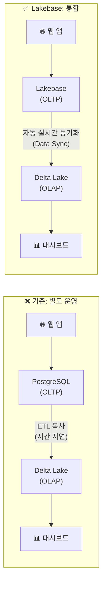
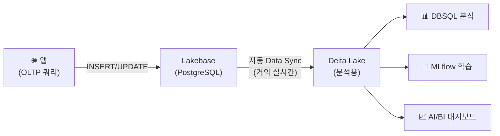

# Lakebase란?

## 개념

> 💡 **Lakebase**는 Databricks가 제공하는 **관리형 PostgreSQL 호환 OLTP 데이터베이스**입니다. 레이크하우스 플랫폼 안에서 OLTP(트랜잭션 처리)와 OLAP(분석)를 하나로 통합하여, 데이터 복사 없이 운영 데이터를 바로 분석에 활용할 수 있게 합니다.

> 💡 **OLTP (Online Transaction Processing)**: 주문 접수, 결제 처리, 재고 차감, 사용자 로그인 등 **건 단위의 빠른 읽기/쓰기**에 최적화된 시스템입니다. 웹 애플리케이션의 백엔드 DB로 사용됩니다. MySQL, PostgreSQL, Oracle이 대표적입니다.

---

## 왜 Lakebase가 필요한가요?

### 기존의 문제: OLTP-OLAP 분리

기존에는 OLTP(MySQL, PostgreSQL)와 OLAP(Databricks)를 **별도로 운영**하고, ETL로 데이터를 복사해야 했습니다. 이로 인해 여러 문제가 발생했습니다.



| 기존 문제 | Lakebase의 해결 |
|-----------|---------------|
| ETL 파이프라인 구축·운영 비용 | Data Sync로 자동 동기화. ETL 불필요 |
| 데이터 지연 (시간~일 단위) | 거의 실시간 동기화 |
| OLTP DB 별도 관리 (패치, 백업, 장애 대응) | Databricks가 완전 관리 |
| 거버넌스 분리 (OLTP/OLAP 별도 권한) | Unity Catalog로 통합 거버넌스 |

---

## 핵심 특징

### PostgreSQL 호환성

Lakebase는 **PostgreSQL 프로토콜과 호환**됩니다. 기존 PostgreSQL 애플리케이션, 드라이버, ORM(SQLAlchemy, Django ORM 등)을 **코드 변경 없이** 그대로 사용할 수 있습니다.

```python
# 기존 PostgreSQL 코드가 그대로 동작합니다
import psycopg2

conn = psycopg2.connect(
    host="<lakebase-host>",
    port=5432,
    dbname="mydb",
    user="<user>",
    password="<token>"
)
```

### 오토스케일링

> 🆕 **Lakebase Autoscaling (GA)**: 워크로드에 따라 컴퓨팅 리소스를 **자동으로 확장/축소**합니다. 트래픽이 적은 시간에는 자동으로 축소되고, 급증 시 자동으로 확장됩니다. 최대 **8TB**까지 스토리지가 자동 확장됩니다.

### Instant Branching

> 💡 **브랜칭(Branching)**이란 현재 데이터베이스의 **즉시 복제본**을 생성하는 기능입니다. Git의 브랜치처럼, 원본에 영향을 주지 않고 별도의 환경에서 작업할 수 있습니다.

| 활용 | 설명 |
|------|------|
| **개발/테스트** | 프로덕션 데이터의 복제본에서 안전하게 테스트합니다 |
| **CI/CD** | 배포 전 스키마 변경을 브랜치에서 검증합니다 |
| **데이터 분석** | 특정 시점의 스냅샷을 분석합니다 |

### 자동 백업 & 복구

| 기능 | 설명 |
|------|------|
| **자동 백업** | 지속적으로 자동 백업됩니다 |
| **Point-in-Time Recovery** | 특정 시점으로 데이터를 복원할 수 있습니다 |
| **보존 기간** | 최대 35일 |

### High Availability

> 🆕 **고가용성(HA)**: 가용 영역(Availability Zone) 간 **자동 장애 조치(Failover)**를 지원합니다. 하나의 AZ에 장애가 발생해도 다른 AZ에서 자동으로 서비스가 계속됩니다.

---

## Delta Lake와의 자동 동기화 (Data Sync)

Lakebase의 가장 차별화된 기능은 **Data Sync**입니다.

> 💡 **Data Sync**는 Lakebase의 데이터를 **자동으로 Delta Lake 테이블에 동기화**하는 기능입니다. Lakebase에서 INSERT/UPDATE/DELETE된 데이터가 거의 실시간으로 Delta 테이블에 반영됩니다.



| 장점 | 설명 |
|------|------|
| **ETL 불필요** | 별도의 ETL 파이프라인을 구축할 필요가 없습니다 |
| **실시간 반영** | OLTP 변경이 거의 실시간으로 분석 테이블에 반영됩니다 |
| **통합 거버넌스** | Unity Catalog에서 OLTP와 OLAP 데이터를 함께 관리합니다 |
| **리니지 추적** | Lakebase → Delta Lake의 데이터 흐름이 리니지로 추적됩니다 |

---

## 사용 시나리오

| 시나리오 | 설명 |
|----------|------|
| **웹 앱 백엔드** | Databricks Apps(Streamlit, FastAPI 등)의 데이터 저장소로 사용합니다 |
| **AI 에이전트 상태 저장** | 에이전트의 대화 이력, 사용자 설정 등을 저장합니다 |
| **실시간 대시보드** | OLTP 데이터가 Data Sync로 즉시 대시보드에 반영됩니다 |
| **ML 피처 저장소** | 실시간 피처를 Lakebase에 저장하고, 배치 분석은 Delta Lake에서 수행합니다 |
| **마이크로서비스 DB** | 각 서비스의 독립적인 DB로 사용합니다 |

---

## 기존 PostgreSQL 서비스와의 비교

| 비교 | Lakebase | Amazon RDS PostgreSQL | Azure Database for PostgreSQL |
|------|----------|----------------------|------------------------------|
| **PostgreSQL 호환** | ✅ | ✅ | ✅ |
| **관리형** | ✅ 완전 관리 | ✅ 완전 관리 | ✅ 완전 관리 |
| **오토스케일링** | ✅ 자동 | ❌ 수동 크기 변경 | ❌ 수동 크기 변경 |
| **Instant Branching** | ✅ | ❌ | ❌ |
| **Delta Lake 동기화** | ✅ 자동 | ❌ ETL 필요 | ❌ ETL 필요 |
| **Unity Catalog 통합** | ✅ | ❌ | ❌ |
| **Databricks 생태계** | ✅ 네이티브 | 별도 연동 필요 | 별도 연동 필요 |
| **HIPAA/규정 준수** | ✅ | ✅ | ✅ |

> 💡 **핵심 차별점**: Lakebase의 가장 큰 가치는 "PostgreSQL + Delta Lake 자동 동기화 + Unity Catalog 통합"입니다. 기존 관리형 PostgreSQL 서비스는 OLTP만 제공하지만, Lakebase는 **OLTP-OLAP 통합**을 추가 비용과 노력 없이 제공합니다.

---

## 정리

| 핵심 기능 | 설명 |
|-----------|------|
| **PostgreSQL 호환** | 기존 앱/드라이버를 코드 변경 없이 사용할 수 있습니다 |
| **오토스케일링** | 워크로드에 따라 자동 확장/축소됩니다 (최대 8TB) |
| **Data Sync** | OLTP 데이터가 자동으로 Delta Lake에 동기화됩니다 |
| **Instant Branching** | 프로덕션 데이터의 즉시 복제본을 생성합니다 |
| **High Availability** | AZ 간 자동 장애 조치를 지원합니다 |
| **Unity Catalog 통합** | 통합 거버넌스 하에서 OLTP/OLAP 데이터를 관리합니다 |

---

## 참고 링크

- [Databricks: Lakebase](https://docs.databricks.com/aws/en/lakebase/)
- [Azure Databricks: Lakebase](https://learn.microsoft.com/en-us/azure/databricks/lakebase/)
- [Databricks Blog: Lakebase](https://www.databricks.com/blog)
- [Databricks: Release Notes — Lakebase](https://docs.databricks.com/aws/en/release-notes/)
