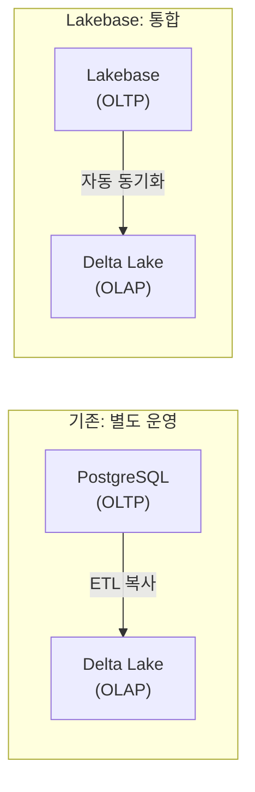

# Lakebase란?

## 개념

> 💡 **Lakebase**는 Databricks가 제공하는 **관리형 PostgreSQL 호환 OLTP 데이터베이스**입니다. 레이크하우스 플랫폼 안에서 OLTP(트랜잭션 처리)와 OLAP(분석)를 하나로 통합합니다.

> 💡 **OLTP (Online Transaction Processing)**: 주문 접수, 결제 처리, 재고 차감 등 **건 단위의 빠른 읽기/쓰기**에 최적화된 시스템입니다. 웹 애플리케이션의 백엔드 DB로 사용됩니다.

---

## 왜 Lakebase가 필요한가요?

기존에는 OLTP(MySQL, PostgreSQL)와 OLAP(Databricks)를 **별도로 운영**하고, ETL로 데이터를 복사해야 했습니다. Lakebase는 OLTP와 OLAP를 하나의 플랫폼에서 제공합니다.

---

## 핵심 특징

| 특징 | 설명 |
|------|------|
| **PostgreSQL 호환** | 기존 PostgreSQL 앱을 그대로 연결할 수 있습니다 |
| **오토스케일링** | 워크로드에 따라 자동으로 확장/축소됩니다 |
| **Delta Lake 동기화** | Lakebase 데이터가 자동으로 Delta 테이블에 동기화됩니다 |
| **Instant Branching** | 데이터베이스의 브랜치를 즉시 생성하여 개발/테스트에 활용합니다 |
| **자동 백업** | 자동으로 백업되며, 포인트 인 타임 복구가 가능합니다 |
| **High Availability** | 가용 영역(AZ) 간 자동 장애 조치를 지원합니다 |

> 🆕 **Lakebase Autoscaling GA**: 최대 8TB까지 자동 확장되며, 자동 백업과 포인트 인 타임 복구를 포함합니다.

---

## 참고 링크

- [Databricks: Lakebase](https://docs.databricks.com/aws/en/lakebase/)
