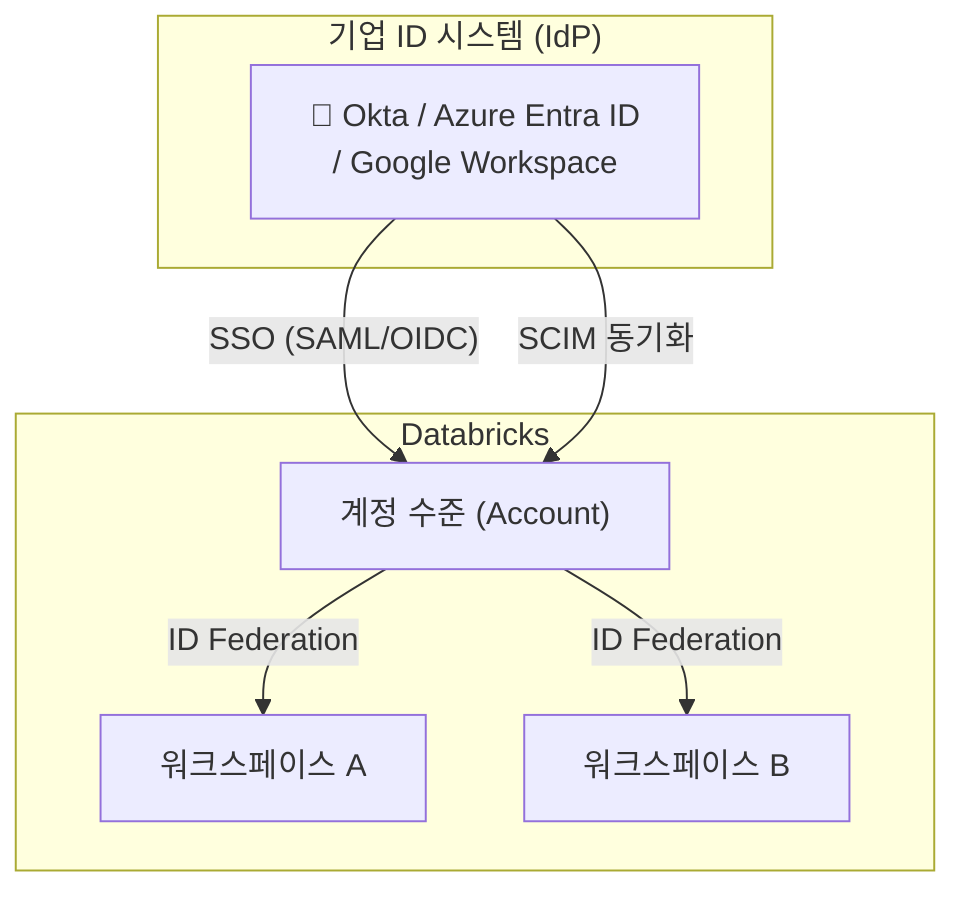
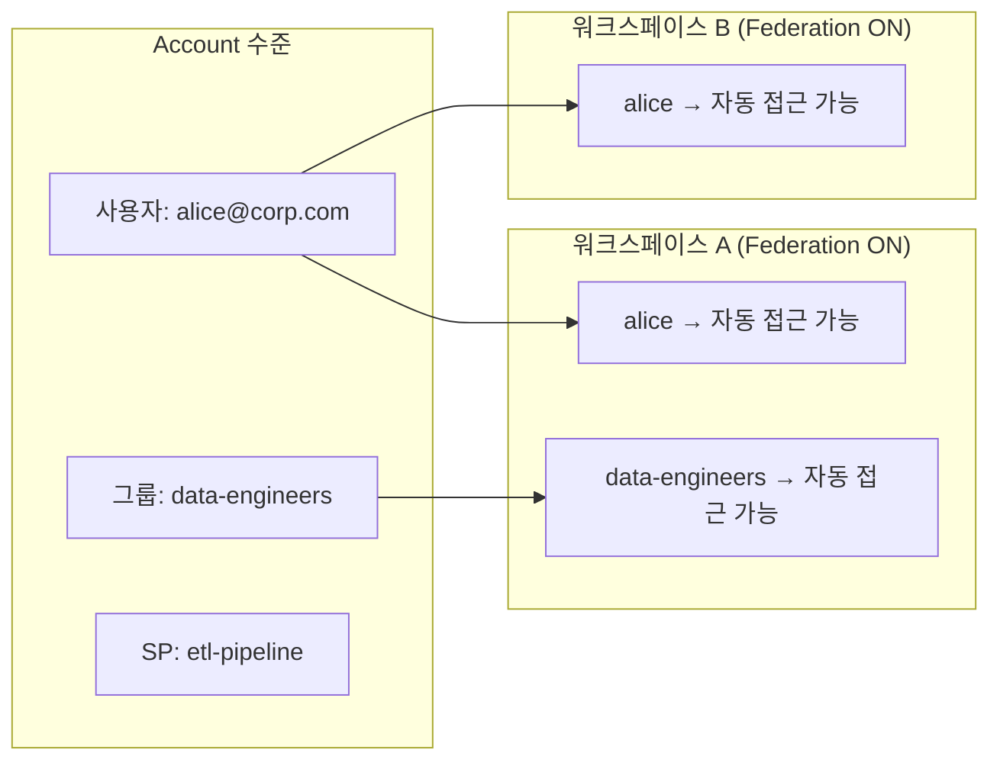
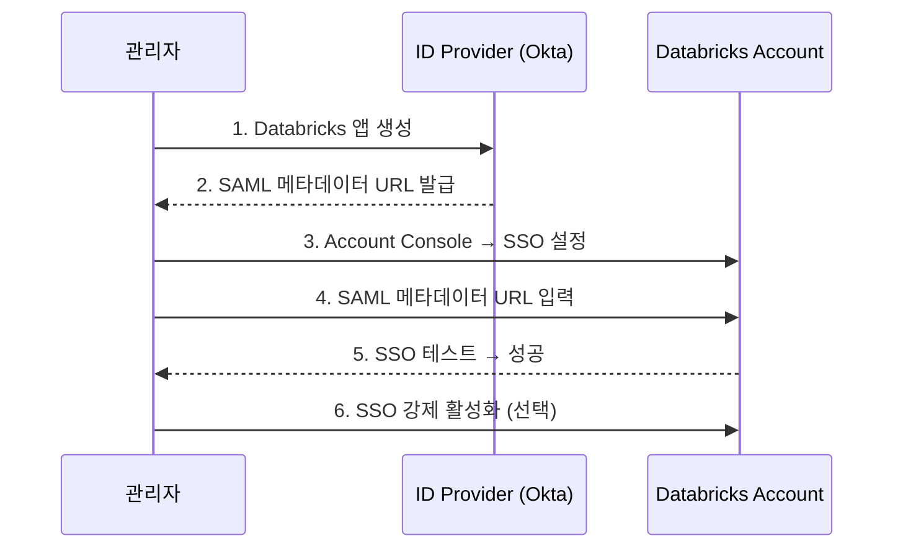
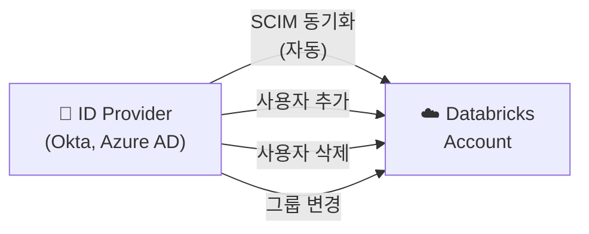
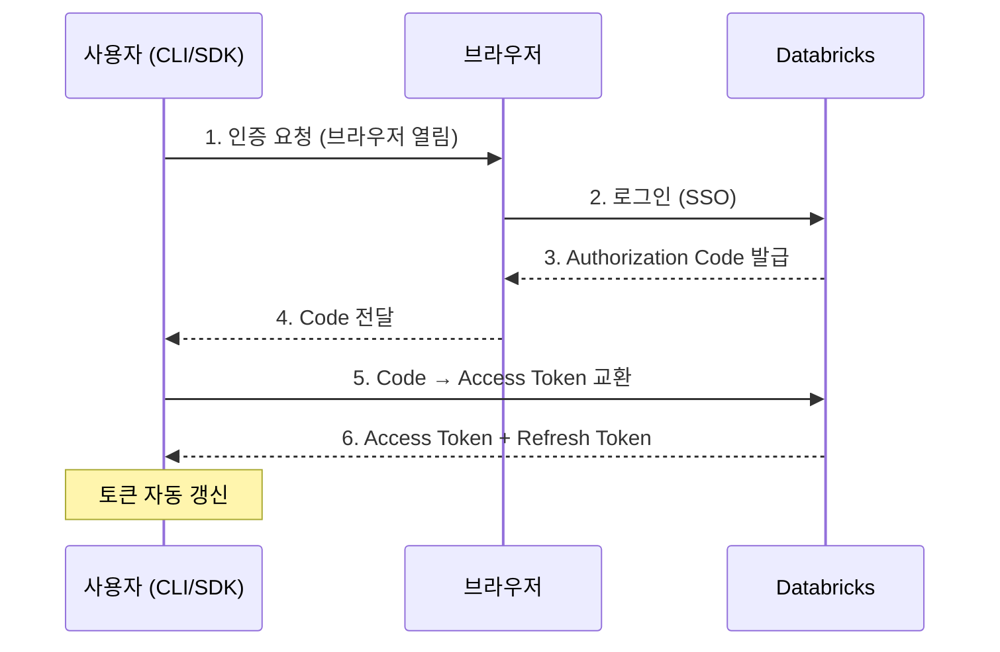
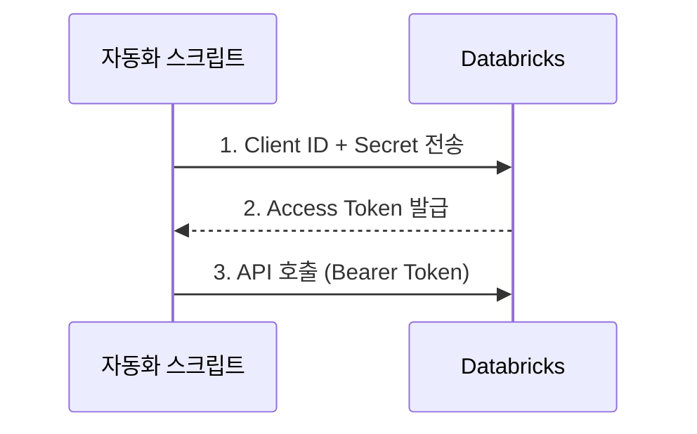
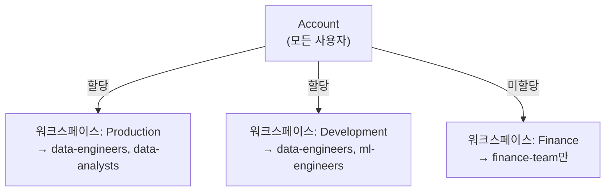

# 인증과 접근 제어 (Identity & Access Management)

## 왜 ID 관리가 중요한가요?

데이터 플랫폼에서 가장 근본적인 보안 질문은 **"이 사람이 누구이며, 무엇을 할 수 있는가?"** 입니다. 아무리 강력한 암호화와 네트워크 보안을 구축해도, ID 관리가 허술하면 권한 없는 사용자가 민감 데이터에 접근하거나 퇴사자의 계정이 방치되는 보안 사고가 발생할 수 있습니다.

> 💡 **IAM(Identity and Access Management)** 은 "누가(Who) 무엇에(What) 어떤 권한으로(How) 접근할 수 있는가"를 체계적으로 관리하는 보안 프레임워크입니다. Databricks는 기업의 기존 ID 시스템(Okta, Azure AD/Entra ID, Google Workspace 등)과 연동하여 통합적인 ID 관리를 제공합니다.



---

## 계정(Account) vs 워크스페이스(Workspace) 수준 ID

Databricks의 ID 관리는 **두 가지 수준**에서 이루어집니다.

| 수준 | 설명 | 관리 주체 |
|------|------|----------|
| **Account 수준** | 조직 전체의 사용자, 그룹, Service Principal을 관리합니다 | Account Admin |
| **Workspace 수준** | 개별 워크스페이스에서의 접근 권한을 관리합니다 | Workspace Admin |

### ID Federation (ID 연합)

> 💡 **ID Federation**은 Account 수준에서 관리하는 사용자/그룹을 **별도 추가 없이** 워크스페이스에서 사용할 수 있게 해주는 기능입니다. ID Federation이 활성화되면, Account에 사용자를 추가하면 해당 사용자가 모든 연합 워크스페이스에서 인증할 수 있습니다.



---

## ID 유형: 사용자, 그룹, 서비스 프린시펄

### 사용자 (User)

개별 사람을 나타내는 ID입니다. 이메일 주소로 식별됩니다.

| 속성 | 설명 |
|------|------|
| **식별자** | 이메일 주소 (예: `alice@corp.com`) |
| **인증 방식** | SSO, 비밀번호, MFA |
| **용도** | 대화형 작업 (노트북, SQL 편집기, 대시보드) |

### 그룹 (Group)

사용자와 Service Principal을 묶어 관리하는 단위입니다. 권한을 개별 사용자 대신 **그룹에 부여**하면 관리가 훨씬 효율적입니다.

| 그룹 유형 | 설명 | 예시 |
|-----------|------|------|
| **Account 그룹** | Account 수준에서 생성. 모든 워크스페이스에서 사용 가능 | `data-engineers`, `data-analysts` |
| **Workspace 로컬 그룹** | 특정 워크스페이스에서만 유효 | `ws-a-admins` |

> 💡 **모범 사례**: 항상 **Account 그룹**을 사용하세요. Workspace 로컬 그룹은 레거시 방식이며, Unity Catalog에서 권한을 부여할 때 Account 그룹만 사용할 수 있습니다.

### 서비스 프린시펄 (Service Principal)

> 💡 **Service Principal(서비스 프린시펄)** 은 사람이 아닌 **애플리케이션/자동화 시스템**을 위한 계정입니다. 개인 계정으로 프로덕션 파이프라인을 실행하면, 그 사람이 퇴사하면 파이프라인이 중단됩니다. Service Principal을 사용하면 이 문제를 방지할 수 있습니다.

```python
# Service Principal로 인증 (Python SDK)
from databricks.sdk import WorkspaceClient

w = WorkspaceClient(
    host="https://dbc-abc123.cloud.databricks.com",
    client_id="<service-principal-client-id>",
    client_secret="<service-principal-secret>"
)
```

| 구분 | 개인 계정 | Service Principal |
|------|----------|-----------------|
| **소유자** | 특정 사용자 | 조직/팀 |
| **수명** | 사용자 퇴사 시 비활성화 | 영구적 |
| **용도** | 대화형 작업 | 프로덕션 자동화 |
| **MFA** | 적용 가능 | 해당 없음 (M2M 인증) |
| **모범 사례** | 개발, 탐색 | **프로덕션 Job, 파이프라인, CI/CD** |

---

## SSO (Single Sign-On) 설정

> 💡 **SSO(Single Sign-On)** 란 한 번 로그인하면 여러 서비스에 추가 로그인 없이 접근할 수 있는 인증 방식입니다. 회사에서 Okta로 로그인하면 Databricks, Slack, JIRA 등에 별도 로그인 없이 바로 접근하는 것이 SSO입니다.

### 지원 프로토콜

| 프로토콜 | 설명 | 적합한 경우 |
|---------|------|-----------|
| **SAML 2.0** | XML 기반 인증 표준. 가장 널리 사용됩니다 | 대부분의 기업 IdP (Okta, Azure AD, OneLogin) |
| **OIDC (OpenID Connect)** | OAuth 2.0 기반 최신 인증 프로토콜입니다 | 최신 클라우드 네이티브 환경 |

### SSO 설정 흐름



### SSO 설정 단계 (Okta 예시)

1. **Okta 관리 콘솔**에서 Databricks 앱을 생성합니다
2. SAML 2.0 설정에서 **Single Sign-On URL**과 **Audience URI**를 입력합니다
   - SSO URL: `https://accounts.cloud.databricks.com/login/saml`
   - Audience URI: `https://accounts.cloud.databricks.com`
3. **Databricks Account Console** > **Settings** > **Single sign-on**에서 SAML 설정을 입력합니다
4. **Test SSO**로 동작을 확인합니다
5. 성공 확인 후 **비밀번호 로그인 비활성화**를 권장합니다

> ⚠️ **SSO 강제 전 주의**: SSO를 강제 활성화하기 전에 반드시 테스트를 완료하세요. SSO 설정이 잘못된 상태에서 비밀번호 로그인을 비활성화하면 모든 사용자가 로그인할 수 없게 됩니다.

---

## SCIM 프로비저닝

> 💡 **SCIM(System for Cross-domain Identity Management)** 은 사용자와 그룹 정보를 기업의 ID 공급자(IdP)에서 Databricks로 **자동 동기화**하는 표준 프로토콜입니다.

### SCIM의 동작



| SCIM으로 동기화되는 정보 | 설명 |
|------------------------|------|
| **사용자 생성/삭제** | IdP에서 사용자를 추가/삭제하면 Databricks에도 자동 반영됩니다 |
| **그룹 멤버십** | IdP의 그룹(예: "data-engineers")에 사용자를 추가하면, Databricks 그룹에도 자동 추가됩니다 |
| **사용자 비활성화** | 퇴사 등으로 IdP에서 비활성화하면 Databricks에서도 비활성화됩니다 |
| **사용자 속성** | 이름, 이메일, 부서 등 프로필 정보가 동기화됩니다 |

### 왜 SCIM이 중요한가요?

SCIM 없이는 Databricks에서 사용자를 **수동으로** 추가/삭제해야 합니다. 직원이 수백~수천 명인 조직에서 이는 매우 비효율적이고, 퇴사자의 접근 권한이 제때 회수되지 않는 보안 위험이 발생합니다.

### SCIM 설정 (Account 수준)

SCIM은 **Account 수준**에서 설정하는 것이 권장됩니다.

1. **Account Console** > **Settings** > **User provisioning** 이동
2. **Enable SCIM provisioning** 클릭
3. **SCIM Token** 생성 및 복사
4. IdP(Okta, Azure AD)에서 Databricks SCIM 앱을 설정합니다:
   - SCIM Base URL: `https://accounts.cloud.databricks.com/api/2.0/accounts/<account-id>/scim/v2`
   - Bearer Token: 위에서 생성한 토큰
5. 동기화할 사용자/그룹을 선택하고 프로비저닝을 시작합니다

> 💡 **Account 수준 SCIM vs Workspace 수준 SCIM**: Account 수준 SCIM을 사용하면 모든 워크스페이스에 자동 반영되므로, 워크스페이스마다 별도로 SCIM을 설정할 필요가 없습니다.

---

## MFA (다중 인증)

> 💡 **MFA(Multi-Factor Authentication)** 는 비밀번호 외에 추가 인증 수단(OTP, 푸시 알림, 보안 키)을 요구하여 계정 보안을 강화하는 방법입니다. 비밀번호가 유출되더라도 MFA가 있으면 무단 접근을 방지할 수 있습니다.

### MFA 적용 방식

| 방식 | 설명 |
|------|------|
| **IdP 측 MFA** | SSO를 사용하는 경우, IdP(Okta, Azure AD)에서 MFA를 설정합니다. **가장 권장되는 방식**입니다 |
| **Databricks 내장 MFA** | Databricks 자체 비밀번호 로그인 시 사용할 수 있는 TOTP(시간 기반 OTP)입니다 |

> 💡 SSO를 사용하는 환경에서는 **IdP 측에서 MFA를 강제**하는 것이 가장 효과적입니다. Databricks에서 별도로 MFA를 설정할 필요 없이, IdP의 정책 한 곳에서 관리할 수 있습니다.

---

## OAuth 2.0 인증 흐름

Databricks는 OAuth 2.0을 지원하여 안전한 토큰 기반 인증을 제공합니다.

### 사용자 대화형 인증 (U2M: User-to-Machine)

사용자가 브라우저를 통해 인증하는 흐름입니다. Databricks CLI, SDK에서 사용합니다.



```bash
# Databricks CLI에서 OAuth U2M 인증
databricks auth login --host https://dbc-abc123.cloud.databricks.com
# 브라우저가 자동으로 열려 로그인 진행
```

### 서비스 간 인증 (M2M: Machine-to-Machine)

Service Principal이 Client ID + Secret으로 토큰을 발급받는 흐름입니다.



```python
# M2M OAuth 인증
from databricks.sdk import WorkspaceClient

w = WorkspaceClient(
    host="https://dbc-abc123.cloud.databricks.com",
    client_id="<sp-client-id>",
    client_secret="<sp-client-secret>"
)
```

---

## PAT (Personal Access Token) 관리

> 💡 **PAT(Personal Access Token)** 는 `dapi` 접두사가 붙는 개인용 API 토큰입니다. 간단한 API 호출이나 개발 환경에서 사용하지만, OAuth보다 보안성이 낮으므로 프로덕션에서는 권장하지 않습니다.

### PAT vs OAuth 비교

| 항목 | PAT | OAuth |
|------|-----|-------|
| **토큰 형식** | `dapi...` 문자열 | JWT (자동 갱신) |
| **만료** | 수동 설정 (무기한 가능) | 자동 만료 + 갱신 |
| **권한 범위** | 전체 권한 (또는 Scoped) | 세밀한 범위 지정 |
| **보안 수준** | 낮음 (유출 위험) | 높음 (자동 갱신, 범위 제한) |
| **적합한 용도** | 개발, 빠른 테스트 | 프로덕션, CI/CD |

### PAT 관리 정책

```sql
-- Account Admin: PAT 사용을 제한할 수 있습니다
-- Workspace 설정 > Admin Settings > Personal Access Tokens
-- - 토큰 최대 수명 설정 (예: 90일)
-- - 특정 사용자/그룹만 PAT 생성 허용
-- - PAT 생성 완전 비활성화 (OAuth만 허용)
```

> 🆕 **Scoped Personal Access Tokens (Preview)**: 토큰의 권한 범위를 API 유형별로 제한할 수 있습니다. 예를 들어, SQL 실행만 허용하고 클러스터 생성은 불허하는 토큰을 발급할 수 있습니다.

---

## 워크스페이스 접근 제어

워크스페이스에 누가 접근할 수 있는지를 관리합니다.

### 워크스페이스 권한 수준

| 역할 | 설명 | 할 수 있는 것 |
|------|------|-------------|
| **Account Admin** | 계정 전체를 관리합니다 | 워크스페이스 생성, 사용자/그룹 관리, 청구 |
| **Workspace Admin** | 특정 워크스페이스를 관리합니다 | 클러스터 정책, 접근 제어, 기능 활성화 |
| **User** | 일반 사용자입니다 | 노트북, Job, SQL 쿼리 실행 (부여된 권한 범위 내) |

### 워크스페이스 할당

ID Federation이 활성화된 환경에서, 특정 사용자/그룹만 워크스페이스에 접근하도록 제한할 수 있습니다.



---

## 실습: Service Principal 생성 및 SCIM 설정

### 실습 1: Service Principal 생성

```bash
# Databricks CLI로 Service Principal 생성
databricks service-principals create \
  --display-name "etl-pipeline-sp" \
  --active true

# 결과 예시
# {
#   "id": "1234567890",
#   "application_id": "abcd-efgh-ijkl-mnop",
#   "display_name": "etl-pipeline-sp",
#   "active": true
# }
```

```bash
# Service Principal에 OAuth Secret 생성
databricks service-principal-secrets create \
  --service-principal-id 1234567890

# 결과 예시
# {
#   "id": "secret-id",
#   "secret": "<generated-secret>",  ← 이 값을 안전하게 저장하세요!
#   "status": "ACTIVE"
# }
```

```bash
# Service Principal을 그룹에 추가
databricks groups patch data-engineers \
  --json '{
    "Operations": [{
      "op": "add",
      "value": {
        "members": [{"value": "1234567890"}]
      }
    }]
  }'
```

### 실습 2: Service Principal로 Job 실행

```python
# Job 정의 시 Service Principal을 실행 주체로 지정
from databricks.sdk import WorkspaceClient

w = WorkspaceClient()

job = w.jobs.create(
    name="daily-etl",
    run_as={"service_principal_name": "etl-pipeline-sp"},
    tasks=[{
        "task_key": "etl-task",
        "notebook_task": {
            "notebook_path": "/Repos/production/etl-pipeline"
        },
        "existing_cluster_id": "cluster-id"
    }]
)
```

---

## 인증 방식 비교 총정리

| 방식 | 대상 | 보안 수준 | 적합한 용도 |
|------|------|----------|-----------|
| **SSO (SAML/OIDC)** | 사용자 | 높음 | 웹 로그인 (기본 권장) |
| **MFA** | 사용자 | 매우 높음 | SSO와 함께 사용 |
| **OAuth U2M** | 사용자 | 높음 | CLI, SDK, 대화형 작업 |
| **OAuth M2M** | Service Principal | 높음 | 자동화, CI/CD |
| **PAT** | 사용자 | 중간 | 개발, 빠른 테스트 |
| **Scoped PAT** | 사용자 | 중~높 | 제한된 API 접근 |

---

## 모범 사례 (Best Practices)

| 원칙 | 설명 |
|------|------|
| **SSO 필수 사용** | 모든 사용자 로그인에 SSO를 강제합니다. 비밀번호 기반 로그인을 비활성화합니다 |
| **MFA 활성화** | SSO와 함께 MFA를 활성화하여 계정 탈취를 방지합니다 |
| **Service Principal 사용** | 프로덕션 Job/파이프라인은 반드시 Service Principal로 실행합니다 |
| **SCIM 연동** | IdP(Okta, Azure AD)와 SCIM을 연동하여 사용자/그룹을 자동 동기화합니다 |
| **Account 수준 SCIM** | Workspace 수준이 아닌 Account 수준에서 SCIM을 설정합니다 |
| **Account 그룹 사용** | Workspace 로컬 그룹 대신 Account 그룹을 사용합니다 |
| **PAT 최소화** | PAT은 개발용으로만 사용하고, 만료 기간을 설정합니다 |
| **토큰 범위 제한** | Scoped PAT을 사용하여 필요한 최소 범위만 허용합니다 |
| **최소 권한 원칙** | 각 사용자/SP에게 업무에 필요한 최소한의 권한만 부여합니다 |
| **정기 감사** | `system.access.audit` 테이블로 인증 이벤트를 정기적으로 점검합니다 |

---

## 정리

| 핵심 개념 | 설명 |
|-----------|------|
| **Account vs Workspace** | Account 수준에서 ID를 통합 관리하고, 워크스페이스에 할당합니다 |
| **ID Federation** | Account의 사용자/그룹을 워크스페이스에서 자동으로 사용할 수 있습니다 |
| **SSO** | 기업 IdP와 연동한 통합 로그인입니다. 모든 사용자에게 권장됩니다 |
| **SCIM** | IdP → Databricks 사용자/그룹 자동 동기화 프로토콜입니다 |
| **Service Principal** | 자동화/프로덕션용 서비스 계정입니다. 개인 계정 대신 사용합니다 |
| **OAuth** | U2M(사용자)과 M2M(서비스) 인증을 지원하는 현대적 인증 방식입니다 |
| **PAT** | API/CLI용 개인 토큰입니다. 개발 환경에서만 제한적으로 사용합니다 |
| **MFA** | 다중 인증으로 계정 보안을 강화합니다. IdP 측에서 설정하는 것이 권장됩니다 |

---

## 참고 링크

- [Databricks: Identity and access management](https://docs.databricks.com/aws/en/security/auth/)
- [Databricks: Service principals](https://docs.databricks.com/aws/en/admin/users-groups/service-principals.html)
- [Databricks: SCIM provisioning (Account)](https://docs.databricks.com/aws/en/admin/users-groups/scim/)
- [Databricks: SSO setup](https://docs.databricks.com/aws/en/admin/account-settings/sso.html)
- [Databricks: OAuth M2M authentication](https://docs.databricks.com/aws/en/dev-tools/auth/oauth-m2m.html)
- [Azure Databricks: Authentication](https://learn.microsoft.com/en-us/azure/databricks/security/auth/)
