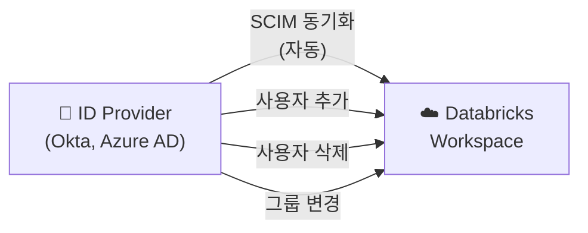

# 인증과 접근 제어

## 인증 (Authentication)

인증은 "**이 사용자가 누구인가?**"를 확인하는 과정입니다. Databricks는 다양한 인증 방식을 지원하여, 기업의 보안 정책에 맞게 설정할 수 있습니다.

### 인증 방식 비교

| 방식 | 설명 | 적합한 사용 |
|------|------|-----------|
| **SSO (Single Sign-On)** | 기업의 ID 공급자(Okta, Azure AD/Entra ID, Google Workspace)와 연동하여 한 번의 로그인으로 여러 서비스에 접근합니다 | 사용자 웹 로그인 (기본 권장) |
| **MFA (Multi-Factor Authentication)** | 비밀번호 외에 추가 인증 수단(OTP, 푸시 알림)을 요구합니다 | 보안 강화 (SSO와 함께 사용) |
| **PAT (Personal Access Token)** | 개인용 API 토큰. `dapi` 접두사가 붙는 문자열입니다 | CLI, API 호출, 개발 |
| **OAuth (M2M)** | 서비스 간 인증. Client ID + Client Secret으로 토큰을 발급받습니다 | 자동화 스크립트, CI/CD |
| **Service Principal** | 사람이 아닌 **서비스 계정**. 프로덕션 파이프라인에 사용합니다 | ETL 작업, 자동화 |

> 💡 **SSO(Single Sign-On)란?** 한 번 로그인하면 여러 서비스에 추가 로그인 없이 접근할 수 있는 인증 방식입니다. 회사에서 Okta로 로그인하면 Databricks, Slack, JIRA 등에 별도 로그인 없이 바로 접근하는 것이 SSO입니다. 보안성이 높고, 사용자 관리가 편리합니다.

### Service Principal 상세

> 💡 **Service Principal(서비스 프린시팔)**은 사람이 아닌 **애플리케이션/자동화 시스템**을 위한 계정입니다. 개인 계정으로 프로덕션 파이프라인을 실행하면, 그 사람이 퇴사하면 파이프라인이 중단됩니다. Service Principal을 사용하면 이 문제를 방지할 수 있습니다.

```python
# Service Principal로 인증 (Python SDK)
from databricks.sdk import WorkspaceClient

w = WorkspaceClient(
    host="https://dbc-abc123.cloud.databricks.com",
    client_id="<service-principal-client-id>",
    client_secret="<service-principal-secret>"
)
```

| 구분 | 개인 계정 | Service Principal |
|------|----------|-----------------|
| 소유자 | 특정 사용자 | 조직/팀 |
| 수명 | 사용자 퇴사 시 비활성화 | 영구적 |
| 용도 | 대화형 작업 | 프로덕션 자동화 |
| MFA | 적용 가능 | 해당 없음 (M2M 인증) |
| 모범 사례 | 개발, 탐색 | **프로덕션 Job, 파이프라인** |

> 🆕 **Scoped Personal Access Tokens (Preview)**: 토큰의 권한 범위를 API 유형별로 제한할 수 있습니다. 예를 들어, SQL 실행만 허용하고 클러스터 생성은 불허하는 토큰을 발급할 수 있습니다.

---

## SCIM 프로비저닝

> 💡 **SCIM(System for Cross-domain Identity Management)**은 사용자와 그룹 정보를 기업의 ID 공급자(IdP)에서 Databricks로 **자동 동기화**하는 표준 프로토콜입니다.

### SCIM의 동작



| SCIM으로 동기화되는 정보 | 설명 |
|------------------------|------|
| **사용자 생성/삭제** | IdP에서 사용자를 추가/삭제하면 Databricks에도 자동 반영됩니다 |
| **그룹 멤버십** | IdP의 그룹(예: "data-engineers")에 사용자를 추가하면, Databricks 그룹에도 자동 추가됩니다 |
| **사용자 비활성화** | 퇴사 등으로 IdP에서 비활성화하면 Databricks에서도 비활성화됩니다 |

### 왜 SCIM이 중요한가요?

SCIM 없이는 Databricks에서 사용자를 **수동으로** 추가/삭제해야 합니다. 직원이 수백~수천 명인 조직에서 이는 매우 비효율적이고, 퇴사자의 접근 권한이 제때 회수되지 않는 보안 위험이 발생합니다.

---

## 인증 모범 사례

| 원칙 | 설명 |
|------|------|
| **SSO 필수 사용** | 모든 사용자 로그인에 SSO를 강제합니다. 비밀번호 기반 로그인을 비활성화합니다 |
| **MFA 활성화** | SSO와 함께 MFA를 활성화하여 계정 탈취를 방지합니다 |
| **Service Principal 사용** | 프로덕션 Job/파이프라인은 반드시 Service Principal로 실행합니다 |
| **SCIM 연동** | IdP(Okta, Azure AD)와 SCIM을 연동하여 사용자/그룹을 자동 동기화합니다 |
| **PAT 최소화** | PAT은 개발용으로만 사용하고, 만료 기간을 설정합니다 |
| **토큰 범위 제한** | Scoped PAT을 사용하여 필요한 최소 범위만 허용합니다 |
| **정기 감사** | `system.access.audit` 테이블로 인증 이벤트를 정기적으로 점검합니다 |

---

## 정리

| 핵심 개념 | 설명 |
|-----------|------|
| **SSO** | 기업 IdP와 연동한 통합 로그인입니다. 모든 사용자에게 권장됩니다 |
| **Service Principal** | 자동화/프로덕션용 서비스 계정입니다. 개인 계정 대신 사용합니다 |
| **PAT** | API/CLI용 개인 토큰입니다. 개발 환경에서 사용합니다 |
| **SCIM** | IdP → Databricks 사용자/그룹 자동 동기화 프로토콜입니다 |
| **MFA** | 다중 인증으로 계정 보안을 강화합니다 |

---

## 참고 링크

- [Databricks: Authentication](https://docs.databricks.com/aws/en/security/auth/)
- [Databricks: Service principals](https://docs.databricks.com/aws/en/admin/users-groups/service-principals.html)
- [Databricks: SCIM provisioning](https://docs.databricks.com/aws/en/admin/users-groups/scim/)
- [Azure Databricks: Authentication](https://learn.microsoft.com/en-us/azure/databricks/security/auth/)
