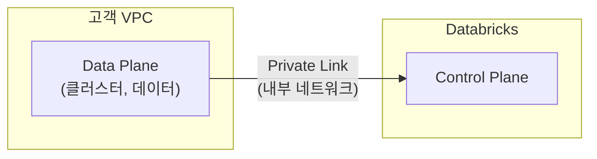

# 네트워크 보안

## 네트워크 격리

### VPC / VNet

Databricks의 Data Plane은 고객의 **VPC(AWS) 또는 VNet(Azure)** 안에서 실행됩니다. 외부에서 직접 접근할 수 없으며, 허용된 경로로만 통신합니다.

### Private Link

> 💡 **Private Link**는 Databricks Control Plane과 Data Plane 간의 통신을 **퍼블릭 인터넷이 아닌 클라우드 내부 네트워크**를 통해 수행하는 기능입니다.

### IP Access List

허용된 IP 주소에서만 Workspace에 접근할 수 있도록 제한합니다.

---

## 참고 링크

- [Databricks: Network security](https://docs.databricks.com/aws/en/security/network/)
