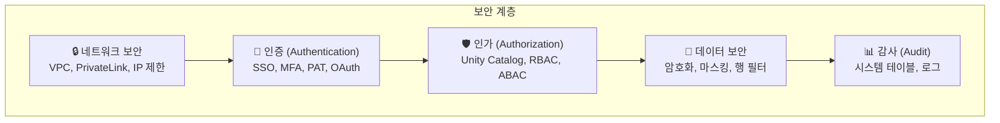

# 보안 개요

## Databricks의 보안 모델

Databricks는 **공유 책임 모델(Shared Responsibility Model)**을 따릅니다.

| 책임 | Databricks | 고객 |
|------|-----------|------|
| Control Plane 보안 | ✅ | |
| 플랫폼 업데이트/패치 | ✅ | |
| 데이터 암호화 (전송/저장) | ✅ | |
| Data Plane 네트워크 설정 | | ✅ |
| 사용자 계정/권한 관리 | | ✅ |
| 데이터 접근 정책 | | ✅ |
| 규정 준수 | 공유 | 공유 |

---

## 보안 계층

---

## 참고 링크

- [Databricks: Security and compliance](https://docs.databricks.com/aws/en/security/)
