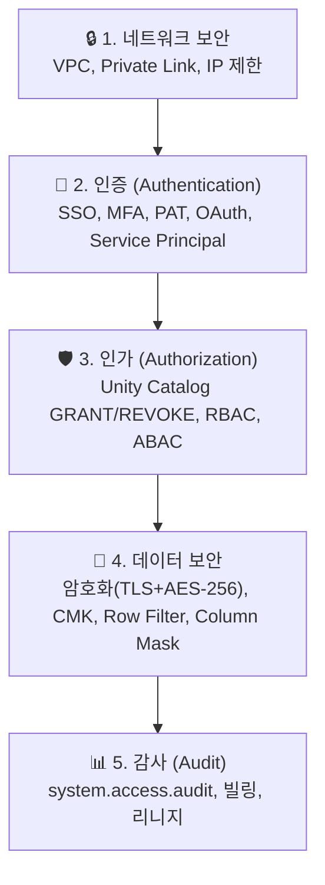

# 보안 개요

## Databricks의 보안 모델

Databricks는 **공유 책임 모델(Shared Responsibility Model)**을 따릅니다. 플랫폼의 보안은 Databricks와 고객이 역할을 나누어 담당합니다.

---

## 공유 책임 모델

| 책임 영역 | Databricks 담당 | 고객 담당 |
|-----------|----------------|----------|
| Control Plane 인프라 보안 | ✅ | |
| 플랫폼 업데이트/보안 패치 | ✅ | |
| 전송/저장 데이터 암호화 | ✅ (기본 활성화) | |
| SOC 2, ISO 27001 등 인증 유지 | ✅ | |
| Data Plane 네트워크 설정 | | ✅ |
| 사용자 계정/그룹 관리 | | ✅ |
| 데이터 접근 정책 (GRANT/REVOKE) | | ✅ |
| IP Access List 설정 | | ✅ |
| Private Link 구성 | | ✅ (선택) |
| CMK(고객 관리 키) 설정 | | ✅ (선택) |
| 규정 준수 (GDPR 등) 이행 | 공유 | 공유 |

---

## 보안 계층 구조

| 계층 | 질문 | Databricks 도구 |
|------|------|----------------|
| **네트워크** | "허용된 네트워크에서만 접근하는가?" | VPC, Private Link, IP Access List |
| **인증** | "이 사용자가 누구인가?" | SSO, MFA, Service Principal, PAT |
| **인가** | "이 사용자가 이 데이터를 볼 수 있는가?" | Unity Catalog GRANT/REVOKE, Row Filter, Column Mask |
| **데이터 보안** | "데이터가 안전하게 저장/전송되는가?" | TLS 1.2+ (전송), AES-256 (저장), CMK (선택) |
| **감사** | "누가 언제 무엇을 했는가?" | 시스템 테이블 (audit, billing, lineage) |

---

## 규정 준수 (Compliance)

Databricks는 주요 보안 인증 및 규정 준수 프레임워크를 지원합니다.

| 인증/규정 | 설명 | 관련 산업 |
|-----------|------|----------|
| **SOC 2 Type II** | 보안, 가용성, 처리 무결성, 기밀성, 개인정보 | 전 산업 |
| **ISO 27001** | 정보보안 관리 시스템(ISMS) 국제 표준 | 전 산업 |
| **HIPAA** | 미국 의료 정보 보호법 | 의료/헬스케어 |
| **GDPR** | EU 개인정보 보호 규정 | EU 대상 사업 |
| **PCI DSS** | 결제 카드 데이터 보안 표준 | 금융/결제 |
| **FedRAMP** | 미국 연방 정부 클라우드 보안 | 공공/정부 |
| **HITRUST** | 건강 정보 보안 프레임워크 | 의료/보험 |

> 🆕 **HITRUST Compliance Controls (Preview)**: 건강 정보 보안을 위한 HITRUST 컨트롤이 Preview로 추가되었습니다.

---

## 보안 구성 권장 단계

| 단계 | 작업 | 우선순위 |
|------|------|---------|
| 1 | **SSO 설정** — 기업 IdP(Okta, Azure AD)와 연동 | 필수 |
| 2 | **MFA 활성화** — 다중 인증 강제 | 필수 |
| 3 | **SCIM 연동** — 사용자/그룹 자동 동기화 | 필수 |
| 4 | **Unity Catalog 활성화** — 데이터 거버넌스 | 필수 |
| 5 | **IP Access List 설정** — 허용 IP 제한 | 권장 |
| 6 | **Service Principal 사용** — 프로덕션 자동화용 | 권장 |
| 7 | **Private Link 구성** — 내부 네트워크 통신 | 규제 산업 |
| 8 | **CMK 설정** — 고객 관리 키 암호화 | 규제 산업 |
| 9 | **시스템 테이블 모니터링** — 감사 대시보드 구축 | 권장 |

---

## 정리

| 핵심 개념 | 설명 |
|-----------|------|
| **공유 책임** | Databricks가 플랫폼 보안, 고객이 데이터 접근 정책을 담당합니다 |
| **5계층 보안** | 네트워크 → 인증 → 인가 → 데이터 → 감사 순서로 보안을 구성합니다 |
| **Unity Catalog** | 데이터 보안의 핵심. GRANT/REVOKE, Row Filter, Column Mask를 제공합니다 |
| **규정 준수** | SOC 2, ISO 27001, HIPAA, GDPR 등 주요 인증을 지원합니다 |

---

## 참고 링크

- [Databricks: Security and compliance](https://docs.databricks.com/aws/en/security/)
- [Databricks: Trust Center](https://www.databricks.com/trust)
- [Azure Databricks: Security](https://learn.microsoft.com/en-us/azure/databricks/security/)
