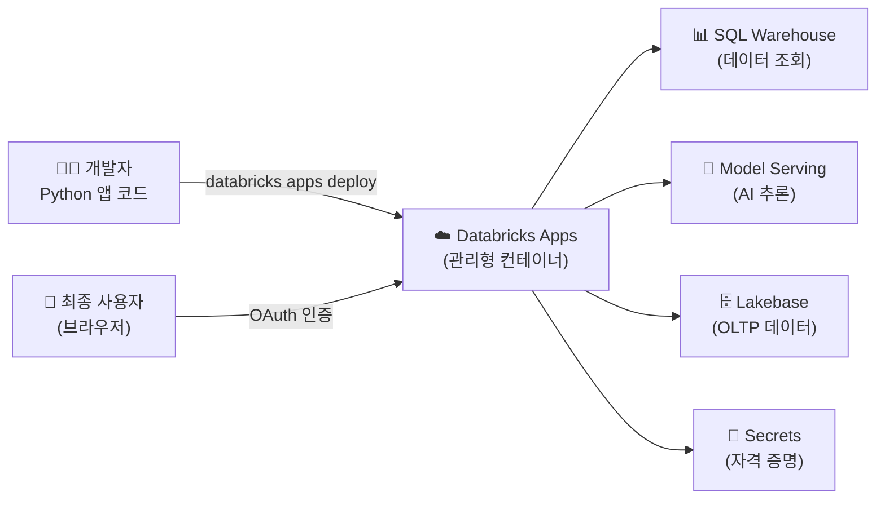
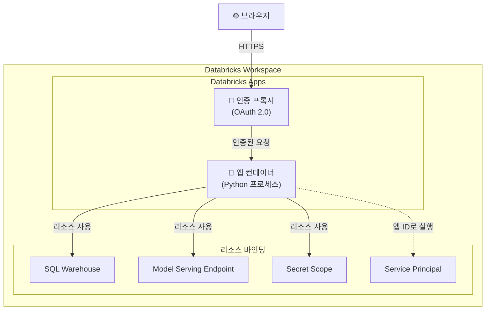
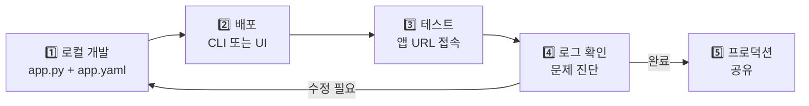

# Databricks Apps

## 왜 Databricks Apps가 필요한가요?

데이터 팀이 분석 결과나 ML 모델을 만들었다고 해서 바로 비즈니스 가치가 생기는 것은 아닙니다. **최종 사용자가 쉽게 접근할 수 있는 웹 애플리케이션** 형태로 제공해야 합니다. 하지만 기존에는 별도의 서버를 프로비저닝하고, 인증을 구현하고, 네트워크를 설정하는 등 복잡한 인프라 작업이 필요했습니다.

> 💡 **Databricks Apps**는 Databricks 플랫폼 위에서 **웹 애플리케이션을 개발, 배포, 호스팅**할 수 있는 관리형 서비스입니다. Streamlit, Gradio, Flask, FastAPI, Dash 등 Python 웹 프레임워크를 지원하며, **별도의 인프라 관리 없이** Databricks의 데이터와 AI 모델에 안전하게 접근하는 앱을 만들 수 있습니다.



---

## 지원 프레임워크

Databricks Apps는 다양한 Python 웹 프레임워크를 지원합니다. 각 프레임워크의 특성에 맞게 선택하면 됩니다.

| 프레임워크 | 적합한 용도 | 특징 |
|-----------|-----------|------|
| **Streamlit** | 데이터 대시보드, ML 데모 | 가장 적은 코드로 대화형 UI 구현. 데이터 앱에 최적화 |
| **Gradio** | AI 모델 인터페이스, 챗봇 | ML 모델 데모에 특화. 입출력 컴포넌트 풍부 |
| **Dash** | 대화형 데이터 시각화 | Plotly 기반. 복잡한 대시보드에 적합 |
| **Flask** | REST API, 커스텀 백엔드 | 경량 웹 프레임워크. 자유도가 높음 |
| **FastAPI** | 고성능 REST API | 비동기 지원, 자동 API 문서 생성 |

> 💡 **어떤 프레임워크를 선택해야 할까요?** 빠르게 데이터 대시보드를 만들고 싶다면 **Streamlit**, AI 모델 데모가 목적이라면 **Gradio**, REST API 백엔드가 필요하다면 **FastAPI**를 추천합니다.

---

## 앱 아키텍처

Databricks Apps는 내부적으로 **컨테이너 기반** 아키텍처로 동작합니다.



### 핵심 아키텍처 구성 요소

| 구성 요소 | 설명 |
|-----------|------|
| **앱 컨테이너** | Python 프로세스가 실행되는 격리된 컨테이너 환경입니다 |
| **인증 프록시** | 모든 요청에 Databricks OAuth 인증을 자동으로 적용합니다 |
| **리소스 바인딩** | `app.yaml`에 선언된 Databricks 리소스(Warehouse, Endpoint 등)에 안전하게 접근합니다 |
| **Service Principal** | 앱 생성 시 자동으로 할당되어, 앱의 ID로 리소스에 접근합니다 |

---

## app.yaml 설정 상세

`app.yaml`은 앱의 실행 방법, 환경 변수, 필요한 리소스를 선언하는 핵심 설정 파일입니다.

### 기본 구조

```yaml
# app.yaml — Streamlit 앱 예시
command:
  - "streamlit"
  - "run"
  - "app.py"
  - "--server.port"
  - "8000"

env:
  - name: "APP_TITLE"
    value: "매출 대시보드"
  - name: "DB_SECRET"
    valueFrom: "my-secret-scope/api-key"  # Secret에서 값 로드

resources:
  - name: "sql-warehouse"
    sql_warehouse:
      id: "${DATABRICKS_WAREHOUSE_ID}"
      permission: "CAN_USE"
  - name: "serving-endpoint"
    serving_endpoint:
      name: "llm-endpoint"
      permission: "CAN_QUERY"
  - name: "secret-scope"
    secret:
      scope: "my-secret-scope"
      key: "api-key"
      permission: "READ"
```

### 설정 항목 상세

| 항목 | 필수 | 설명 |
|------|------|------|
| `command` | Yes | 앱 실행 명령어입니다. 포트는 반드시 **8000**으로 설정해야 합니다 |
| `env` | No | 환경 변수를 정의합니다. `valueFrom`으로 Secret 값을 참조할 수 있습니다 |
| `resources` | No | 앱이 접근할 Databricks 리소스를 선언합니다 |

### 지원되는 리소스 유형

| 리소스 | `app.yaml` 키 | 권한 옵션 |
|--------|---------------|----------|
| SQL Warehouse | `sql_warehouse` | `CAN_USE`, `CAN_MANAGE` |
| Model Serving Endpoint | `serving_endpoint` | `CAN_QUERY`, `CAN_MANAGE` |
| Secret | `secret` | `READ` |
| Lakebase Database | `lakebase_database` | `CAN_USE` |

> ⚠️ **포트 번호 주의**: 앱은 반드시 **포트 8000**에서 수신 대기해야 합니다. 다른 포트를 사용하면 앱이 정상적으로 동작하지 않습니다.

---

## 컴퓨트 사이징

앱의 워크로드에 맞는 컴퓨트 크기를 선택할 수 있습니다.

| 크기 | vCPU | 메모리 | 적합한 용도 |
|------|------|--------|-----------|
| **Small** (기본) | 1 | 2 GB | 경량 대시보드, 간단한 API |
| **Medium** | 2 | 6 GB | 데이터 시각화, 중간 규모 앱 |
| **Large** | 4 | 12 GB | 복잡한 분석, 대량 데이터 처리 |

> 🆕 **컴퓨트 사이징 GA**: Medium(2 vCPU, 6GB)과 Large(4 vCPU, 12GB) 옵션이 GA되어, 앱의 워크로드에 맞는 리소스를 선택할 수 있습니다.

---

## 앱 인증 모델

Databricks Apps는 **두 가지 인증 모델**을 지원합니다.

### 1. 앱 서비스 프린시펄 인증 (App-on-behalf-of-itself)

앱 생성 시 자동으로 할당된 **Service Principal** 의 권한으로 리소스에 접근합니다. 모든 사용자가 동일한 데이터를 보게 됩니다.

```python
# 앱 Service Principal 인증 (기본)
from databricks.sdk import WorkspaceClient

# 앱 내부에서는 자동으로 앱의 Service Principal로 인증됩니다
w = WorkspaceClient()
tables = w.tables.list(catalog_name="main", schema_name="default")
```

### 2. 사용자 대리 인증 (App-on-behalf-of-user)

로그인한 **사용자의 OAuth 토큰**을 사용하여 리소스에 접근합니다. 각 사용자가 자신의 권한에 맞는 데이터만 볼 수 있습니다.

```python
# 사용자 대리 인증
from databricks.sdk import WorkspaceClient

def get_user_client(request_headers):
    """요청 헤더에서 사용자 토큰을 추출하여 클라이언트 생성"""
    w = WorkspaceClient(
        host=os.environ["DATABRICKS_HOST"],
        token=request_headers.get("X-Forwarded-Access-Token")
    )
    return w
```

| 구분 | 앱 Service Principal | 사용자 대리 인증 |
|------|---------------------|----------------|
| **데이터 접근** | 모든 사용자가 동일 | 사용자별 권한 적용 |
| **설정 복잡도** | 낮음 (기본값) | 중간 (토큰 전달 필요) |
| **적합한 경우** | 공용 대시보드, 공개 데이터 | 개인화된 데이터 뷰, 민감 데이터 |
| **감사(Audit)** | 앱 이름으로 기록 | 실제 사용자 이름으로 기록 |

> 💡 **어떤 인증을 선택해야 할까요?** 데이터에 행/열 수준 보안이 필요하거나, 누가 어떤 데이터에 접근했는지 감사 추적이 중요하다면 **사용자 대리 인증**을 사용하세요.

---

## 개발 워크플로

Databricks Apps의 개발은 **로컬 개발 → 배포 → 테스트 → 반복** 사이클을 따릅니다.



### 로컬 프로젝트 구조

```
my-app/
├── app.py           # 메인 앱 코드
├── app.yaml         # Databricks Apps 설정
├── requirements.txt # 추가 Python 패키지
└── static/          # 정적 파일 (선택)
    └── logo.png
```

---

## 배포 방법

### 방법 1: Databricks CLI

```bash
# 1. 앱 생성 (최초 1회)
databricks apps create my-dashboard \
  --description "매출 분석 대시보드"

# 2. 앱 배포 (코드 업로드 + 시작)
databricks apps deploy my-dashboard \
  --source-code-path ./my-app

# 3. 앱 상태 확인
databricks apps get my-dashboard

# 4. 앱 로그 확인
databricks apps get-logs my-dashboard
```

### 방법 2: Workspace UI

1. 좌측 메뉴에서 **Compute** > **Apps** 선택
2. **Create App** 클릭
3. 앱 이름과 설명 입력
4. 소스 코드 업로드 또는 Git 연결
5. 리소스 바인딩 설정
6. **Deploy** 클릭

### 방법 3: Databricks Asset Bundles (DABs)

프로덕션 환경에서는 DABs로 앱을 인프라-as-코드로 관리할 수 있습니다.

```yaml
# databricks.yml
bundle:
  name: my-dashboard

resources:
  apps:
    my-dashboard:
      name: "my-dashboard"
      description: "매출 분석 대시보드"
      source_code_path: ./src
      config:
        command:
          - "streamlit"
          - "run"
          - "app.py"
          - "--server.port"
          - "8000"
        resources:
          - name: "warehouse"
            sql_warehouse:
              id: "${var.warehouse_id}"
              permission: "CAN_USE"
```

---

## 데이터 접근 방법

앱에서 Databricks 데이터에 접근하는 주요 방법입니다.

### SQL Warehouse를 통한 데이터 조회

```python
import streamlit as st
from databricks import sql
import os

# SQL Warehouse 연결 (리소스 바인딩 활용)
connection = sql.connect(
    server_hostname=os.environ["DATABRICKS_HOST"],
    http_path=os.environ["DATABRICKS_SQL_WAREHOUSE_HTTP_PATH"],
    credentials_provider=lambda: {
        "Authorization": f"Bearer {os.environ['DATABRICKS_TOKEN']}"
    }
)

cursor = connection.cursor()
cursor.execute("SELECT * FROM main.sales.daily_revenue LIMIT 100")
df = cursor.fetchall_arrow().to_pandas()

st.dataframe(df)
```

### Databricks SDK 사용

```python
from databricks.sdk import WorkspaceClient

w = WorkspaceClient()

# Unity Catalog 테이블 목록 조회
for table in w.tables.list(catalog_name="main", schema_name="sales"):
    print(f"테이블: {table.name}")
```

---

## Model Serving 연동 (LLM 챗봇 예제)

Databricks Apps와 Model Serving Endpoint를 연동하면 AI 챗봇을 쉽게 만들 수 있습니다.

```python
# app.py — Streamlit LLM 챗봇
import streamlit as st
from databricks.sdk import WorkspaceClient

st.title("🤖 AI 어시스턴트")

w = WorkspaceClient()

# 채팅 히스토리 관리
if "messages" not in st.session_state:
    st.session_state.messages = []

# 이전 메시지 표시
for message in st.session_state.messages:
    with st.chat_message(message["role"]):
        st.markdown(message["content"])

# 사용자 입력
if prompt := st.chat_input("질문을 입력하세요"):
    st.session_state.messages.append({"role": "user", "content": prompt})

    with st.chat_message("user"):
        st.markdown(prompt)

    # Model Serving Endpoint 호출
    response = w.serving_endpoints.query(
        name="llm-endpoint",
        messages=[
            {"role": "system", "content": "당신은 데이터 분석 전문가입니다."},
            *st.session_state.messages
        ]
    )

    assistant_message = response.choices[0].message.content

    with st.chat_message("assistant"):
        st.markdown(assistant_message)

    st.session_state.messages.append(
        {"role": "assistant", "content": assistant_message}
    )
```

해당 `app.yaml` 설정은 다음과 같습니다.

```yaml
command:
  - "streamlit"
  - "run"
  - "app.py"
  - "--server.port"
  - "8000"

resources:
  - name: "llm-endpoint"
    serving_endpoint:
      name: "llm-endpoint"
      permission: "CAN_QUERY"
```

---

## 실습: Streamlit 매출 대시보드 생성 및 배포

### Step 1: 프로젝트 생성

```bash
mkdir sales-dashboard && cd sales-dashboard
```

### Step 2: app.py 작성

```python
# app.py
import streamlit as st
from databricks import sql
import os
import pandas as pd

st.set_page_config(page_title="매출 대시보드", layout="wide")
st.title("📊 일별 매출 대시보드")

# SQL Warehouse 연결
@st.cache_resource
def get_connection():
    return sql.connect(
        server_hostname=os.environ["DATABRICKS_HOST"],
        http_path=os.environ["DATABRICKS_SQL_WAREHOUSE_HTTP_PATH"],
        credentials_provider=lambda: {
            "Authorization": f"Bearer {os.environ['DATABRICKS_TOKEN']}"
        }
    )

conn = get_connection()

# 데이터 조회
@st.cache_data(ttl=300)  # 5분 캐시
def load_data():
    cursor = conn.cursor()
    cursor.execute("""
        SELECT sale_date, total_revenue, total_orders, unique_customers
        FROM main.ecommerce.gold_daily_kpi
        ORDER BY sale_date DESC
        LIMIT 90
    """)
    return cursor.fetchall_arrow().to_pandas()

df = load_data()

# KPI 카드
col1, col2, col3 = st.columns(3)
col1.metric("총 매출", f"₩{df['total_revenue'].sum():,.0f}")
col2.metric("총 주문", f"{df['total_orders'].sum():,}건")
col3.metric("고유 고객", f"{df['unique_customers'].sum():,}명")

# 차트
st.line_chart(df.set_index("sale_date")["total_revenue"])
st.dataframe(df, use_container_width=True)
```

### Step 3: app.yaml 작성

```yaml
command:
  - "streamlit"
  - "run"
  - "app.py"
  - "--server.port"
  - "8000"

resources:
  - name: "sql-warehouse"
    sql_warehouse:
      id: "${DATABRICKS_WAREHOUSE_ID}"
      permission: "CAN_USE"
```

### Step 4: requirements.txt 작성

```
streamlit
databricks-sql-connector
pandas
pyarrow
```

### Step 5: 배포

```bash
# 앱 생성 및 배포
databricks apps create sales-dashboard --description "일별 매출 대시보드"
databricks apps deploy sales-dashboard --source-code-path .

# 배포 상태 확인
databricks apps get sales-dashboard
```

### Step 6: 접속 및 테스트

배포가 완료되면 `https://<workspace-url>/apps/sales-dashboard`에서 앱에 접근할 수 있습니다. 같은 워크스페이스의 사용자는 Databricks OAuth로 자동 인증됩니다.

---

## 리소스 제한 및 비용

| 항목 | 제한 |
|------|------|
| **앱당 최대 소스 코드** | 500 MB |
| **앱당 최대 메모리** | 크기에 따라 2~12 GB |
| **워크스페이스당 앱 수** | 계정 등급에 따라 다름 |
| **자동 유휴 중지** | 비활성 앱은 자동으로 중지됩니다 |
| **과금** | 앱이 실행 중인 시간 기준 DBU 과금 |

---

## 모범 사례

| 영역 | 권장 사항 |
|------|----------|
| **인증** | 민감 데이터는 사용자 대리 인증을 사용합니다 |
| **성능** | `st.cache_data`/`st.cache_resource`로 데이터 캐싱을 적용합니다 |
| **비밀 관리** | API 키 등은 `env.valueFrom`으로 Secret에서 로드합니다. 코드에 하드코딩하지 않습니다 |
| **컴퓨트 크기** | 워크로드에 맞는 최소 크기를 선택하여 비용을 절감합니다 |
| **배포** | 프로덕션 앱은 DABs로 관리하여 버전 관리 및 CI/CD를 적용합니다 |
| **모니터링** | `databricks apps get-logs`로 앱 로그를 정기적으로 확인합니다 |
| **리소스 바인딩** | 필요한 리소스만 최소 권한으로 바인딩합니다 |

---

## 트러블슈팅

| 증상 | 원인 | 해결 방법 |
|------|------|----------|
| 앱이 시작되지 않음 | 포트가 8000이 아님 | `--server.port 8000` 확인 |
| `Permission denied` | Service Principal 권한 부족 | 앱의 SP에 리소스 접근 권한 부여 |
| 패키지 설치 실패 | `requirements.txt` 누락 | 필요한 패키지를 `requirements.txt`에 명시 |
| 데이터 조회 실패 | SQL Warehouse 미바인딩 | `app.yaml`에 `sql_warehouse` 리소스 추가 |
| 앱이 자주 중지됨 | 유휴 자동 중지 | 트래픽이 없으면 정상 동작. 재접속 시 자동 재시작 |

---

## 정리

| 핵심 개념 | 설명 |
|-----------|------|
| **Databricks Apps** | Databricks 위에서 웹 앱을 호스팅하는 관리형 서비스입니다 |
| **app.yaml** | 앱의 실행 명령, 환경 변수, 리소스 바인딩을 선언하는 설정 파일입니다 |
| **리소스 바인딩** | SQL Warehouse, Model Serving, Secret 등에 안전하게 접근합니다 |
| **인증 모델** | 앱 SP 인증(기본)과 사용자 대리 인증(개인화) 중 선택합니다 |
| **컴퓨트 사이징** | Small/Medium/Large로 앱 워크로드에 맞는 리소스를 할당합니다 |
| **배포** | CLI, UI, DABs 중 선택하여 배포할 수 있습니다 |

---

## 참고 링크

- [Databricks: Databricks Apps 개요](https://docs.databricks.com/aws/en/dev-tools/databricks-apps/)
- [Databricks: App 설정 (app.yaml)](https://docs.databricks.com/aws/en/dev-tools/databricks-apps/configuration.html)
- [Databricks: Databricks Apps 튜토리얼](https://docs.databricks.com/aws/en/dev-tools/databricks-apps/tutorials.html)
- [Azure Databricks: Databricks Apps](https://learn.microsoft.com/en-us/azure/databricks/dev-tools/databricks-apps/)
