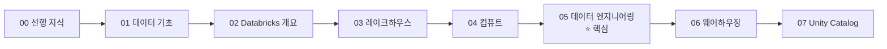
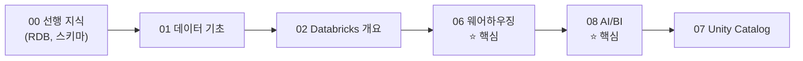
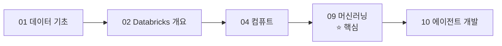
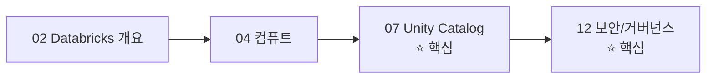

# 학습 로드맵

## 역할별 추천 학습 경로

### 데이터 엔지니어 (Data Engineer)

**필수**: 00 → 01 → 02 → 03 → 04 → 05 (전체) → 07
**권장**: 06, 12

---

### 데이터 분석가 (Data Analyst)

**필수**: 00(RDB, 스키마) → 01 → 02 → 06 → 08
**권장**: 03(Medallion), 07

---

### 데이터 과학자 (Data Scientist)

**필수**: 01 → 02 → 04 → 09 (전체)
**권장**: 03, 10

---

### 플랫폼 관리자 (Admin)

**필수**: 02 → 04 → 07 → 12
**권장**: 03, 06

---

### AI/ML 엔지니어

**필수**: 01 → 02 → 04 → 09 → 10 (전체)
**권장**: 03, 07, 11

---

## 전체 학습 순서 (처음부터 끝까지)

모든 내용을 체계적으로 학습하고 싶다면, **00 → 01 → 02 → 03 → 04 → 05 → 06 → 07 → 08 → 09 → 10 → 11 → 12 → 13** 순서대로 진행하시면 됩니다.

---

## 외부 학습 리소스

| 리소스 | URL | 설명 |
|--------|-----|------|
| **Databricks Academy** | academy.databricks.com | 공식 교육 과정 (무료/유료) |
| **Databricks Certifications** | databricks.com/learn/certification | 공식 자격증 |
| **Databricks Community** | community.databricks.com | 커뮤니티 포럼 |
| **Databricks Blog** | databricks.com/blog | 최신 기술 블로그 |
| **Delta Lake Docs** | docs.delta.io | Delta Lake 오픈소스 문서 |
| **MLflow Docs** | mlflow.org/docs | MLflow 오픈소스 문서 |
